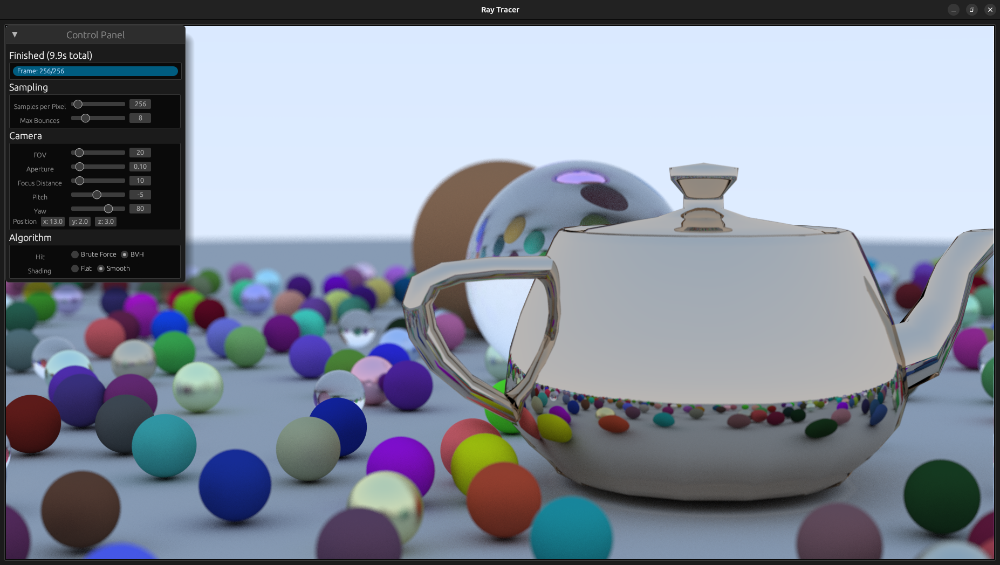

# Ray Tracing in Rust with WGPU



A simple ray tracing implementation in Rust using WGPU, inspired by the [_Ray Tracing in One Weekend Series_](https://raytracing.github.io).

## Running the Project

This project runs directly in the browser which can be accessed at [this projrct's GitHub Pages](https://quantumspawner.github.io/ray_tracing_wgpu).

> [!WARNING]
> Currently only supports Chrome and Edge since they are the only browsers that support WebGPU. Checkout [WebGPU Implementation Status](https://github.com/gpuweb/gpuweb/wiki/Implementation-Status) for more details.

### Camera and Render Controls

- Move the camera using WASD keys.
- Pan the camera by dragging the mouse.
- Change field of view using the mouse wheel.
- Adjust other parameters in the control panel.

## Building the Project

### Prerequisites

Install rust compiler `rustc` and builder/package manager `cargo` from [Install Rust](https://www.rust-lang.org/tools/install).

### Build for Desktop

1. (For Linux systems) Install dependencies by:
    ```bash
    sudo apt-get install -y \
        libclang-dev \
        libgtk-3-dev \
        libxcb-render0-dev \
        libxcb-shape0-dev \
        libxcb-xfixes0-dev \
        libxkbcommon-dev libssl-dev
    ```

2. Build and run the project by:
    ```bash
    cargo run --release
    ```

### Build for Web

1. Add the `wasm32-unknown-unknown` target and install `web-bindgen` tool by:

    ```bash
    rustup target add wasm32-unknown-unknown
    cargo install wasm-bindgen-cli
    ```

2. Build and generate bindings for the web by:

    ```bash
    cargo build --target wasm32-unknown-unknown --release
    wasm-bindgen target/wasm32-unknown-unknown/release/ray_tracing_wgpu.wasm --out-dir web --web
    ```

3. Serve the `web` directory using a web server. The provided method is to use `nginx` in a `docker` container:

    ```bash
    cd web
    docker compose up -d
    ```

    The application will be available at [http://localhost:8080](http://localhost:8080).

## Project Structure

### Rust

I choose to use Rust as the main programming language mainly because I want to learn it and to experience its safety features and funtional programming designs.

It has a great ecosystem for system programming, providing numerous crates (Rust packages) for building desktop applications. Inclueding but not limited to:

- [egui](https://www.egui.rs): GUI framework for handling input and building the control panel.
- [wgpu](https://wgpu.rs): GPU programming framework based on the WebGPU API.
- [cgmath](https://docs.rs/cgmath/latest/cgmath): Math library for graphics applications.
- [encase](https://docs.rs/encase/latest/encase): Utility library that serializes Rust structures to conform to WebGPU memory alignment requirements.

Additionally, the integration with WebAssembly (WASM) means not only can it run natively on the desktop, but it can also be compiled to WebAssembly for running in the browser.

### WebGPU

WebGPU is the modern replacement of WebGL for graphics programming in the browser. And its implementation in Rust [wgpu](https://wgpu.rs), is one of the most mature and cross-platform graphics libraries available in Rust.

Both the rendering and compute pipelines of WebGPU are used in this project where the compute pipeline is used for ray tracing calculations, and passing the results via storage buffers to the rendering pipeline for displaying the final image.

### Graphics

This project implements all ray tracing features in [_Ray Tracing in One Weekend_](https://raytracing.github.io/books/RayTracingInOneWeekend.html), including three types of materials (lambertian, metal, and dielectric), and rendering spheres.

Additionally, it implements bounding volume hierarchy (BVH) for acceleration, which is a necessity with the added feature of rendering models built from triangles.

## References

### WebGPU/WGPU

- Tutorials: [WebGPU Fundamentals](https://webgpufundamentals.org)
- Tutorials: [Learn Wgpu](https://sotrh.github.io/learn-wgpu)

### Ray Tracing

- Books: [Ray Tracing in One Weekend Series](https://raytracing.github.io)
- GitHub: [Nelarius/weekend-raytracer-wgpu](https://github.com/Nelarius/weekend-raytracer-wgpu)
- GitHub: [gnikoloff/webgpu-raytracer](https://github.com/gnikoloff/webgpu-raytracer)
- Tutorial: [Ray-Tracing: Rendering a Triangle](https://www.scratchapixel.com/lessons/3d-basic-rendering/ray-tracing-rendering-a-triangle/moller-trumbore-ray-triangle-intersection.html)

### WebAssembly

- Blog: [egui 的基本使用 & egui 编译成 wasm](https://zhuanlan.zhihu.com/p/31819069353)
